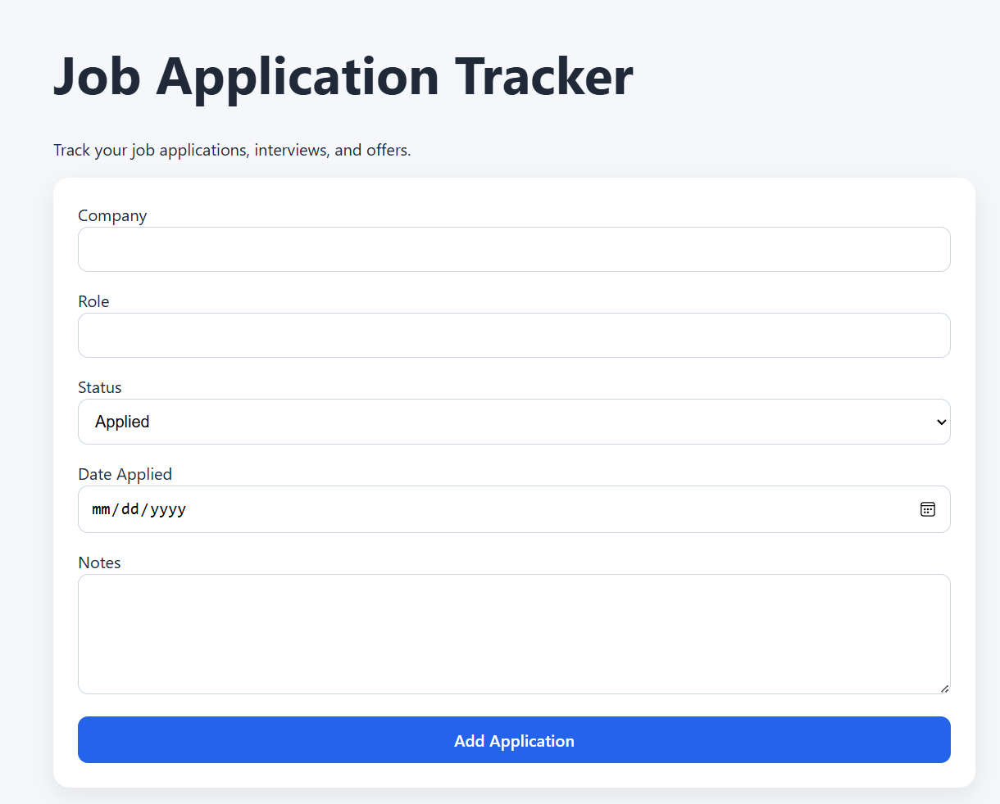
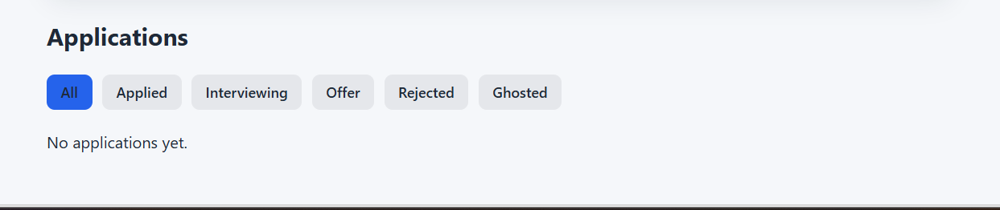

# Job Application Tracker

A React web application for tracking job applications, interview progress, and hiring outcomes.

## Features

- Add job applications
- Track company, role, status, date applied, and notes
- Delete applications
- Filter applications by status
- Highlight active filter
- Save data with localStorage so applications persist after  refresh

## Tech Stack

- React
- JavaScript
- Vite
- HTML
- CSS
- LocalStorage

## Aplication Preview

## How It Works

1. Enter application details in the form.
2. Submit the form to add the application.
3. Applications appear as cards below the form.
4. Use the filter buttons to sort by application status.
5. Delete applications when needed.
6. Data stays saved in the browser using localStorage.

## Future Improvements

- Edit application details
- Add dashboard stats
- Sort by date
- Export applications
- Add follow-up reminders

## Author

Nicole Stephanie Haugaard Torres